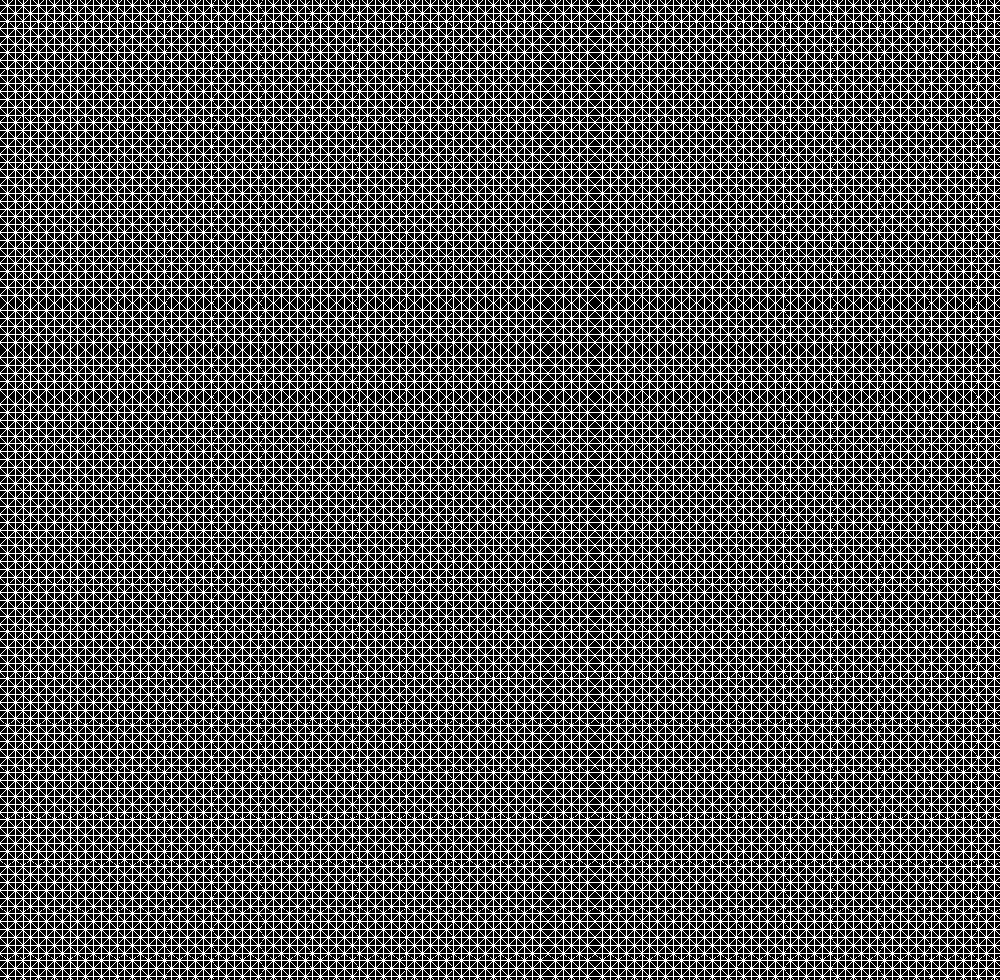
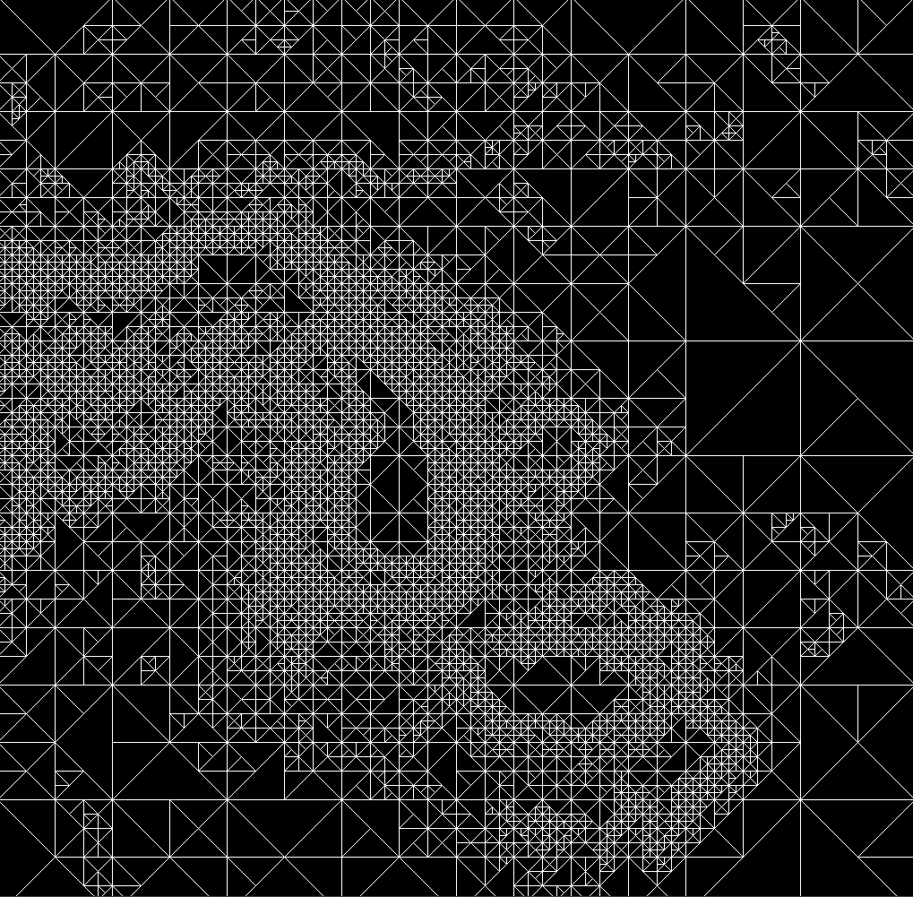

:brazil:
# Mostragem da Diferença de Elevação de Terrenos Utilizando Árvore Binária


## Bibliotecas necessárias
**Apenas se utiliza a biblioteca pygame, para obtê-la basta usar o comando:**
```py
pip install pygame
```
**Recomenda-se também instalar o numpy visando futuras alterações:**
```py
pip install numpy
```
  
## Visualização

*Imagens ilustrativas, o resultado muda conforme a imagem analisada*


| Imagem Escolhida | Visualização Crua | Visualização com Análise |
| :---: | :---: | :---: |
|  |  |  |


## Instruções

* As teclas "→" e "←" servem para alterar entre visualizar a imagem escolhida, a visualização crua e a visualização com análise.
* Quando na visualização crua, as teclas "↑" e "↓" têm o intuito de alterar o nível de refinamento da imagem, ou seja, mais subdivisões serão feitas na árvore binária. Isso implica diretamente na resolução da imagem quando escolhida a visualização com análise.
* Quando na visualização com análise, as teclas "↑" e "↓" têm o intuito de alterar o erro médio permitido no espaço de um quadrante, isto é, a flexibilização do desvio padrão. Se o erro for muito alto a imagem poderá não ser desenhada corretamente, pois há necessidade de erro médio mais baixo para a subdivisão em algumas partes. Assim como, se o erro médio for muito baixo não pode haver quase desvio padrão nenhum naquela área para que ocorra a subdivisão e, nesse caso, a imagem também não será desenhada corretamente.
* A imagem escolhida pode ser alterada no módulo "main.py", é só alterar o diretório dentre os arquivos dentro da pasta "DEMs" ou adicionar novas imagens também.


## Referências bibliográficas
Pygame, **Pygame Documentation**.https://www.pygame.org/docs/

Pixel and Intensy, **Overview** .https://www.thermofisher.com/br/en/home/life-science/cell-analysis/cell-analysis-learning-center/molecular-probes-school-of-fluorescence/imaging-basics/capturing-analyzing-your-samples/pixels-intensity.html
## 
